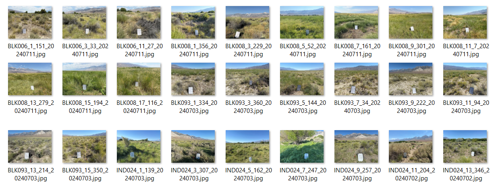
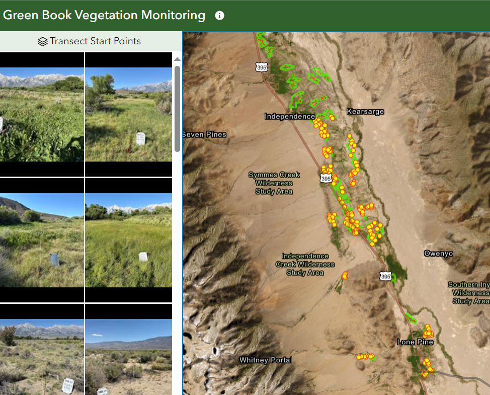

# Line-Point-Photos

Photos taken at transect start points are stored as attachments. Scripts download photos and inherit attribute information of the transect, with the date appended to the filenames.

## Table of Contents
- [Installation](#installation)
- [Usage](#usage)
  - [Downloading Photos](#downloading-photos)
  - [Labeling Photos](#labeling-photos)
- [Examples](#examples)
- [Photo Gallery](#photo-gallery)
- [Contributing](#contributing)
- [License](#license)

## Installation

1. **Clone the repository:**

   ```sh
   git clone https://github.com/inyo-gov/line-point-photos.git
   cd line-point-photos
   ```

2. **Install the required dependencies:**

   ```sh
   pip install -r requirements.txt
   ```

## Usage

### Downloading Photos

The script `download_photos.py` downloads photos from the ArcGIS feature layer and renames them based on the attribute information and date.

To run the script:

```sh
python download_photos.py
```

### Labeling Photos

The script `label_photos.py` processes the downloaded photos, adds labels to them, and saves them in the `labeled_photos` directory organized by year.

To run the script:

```sh
python label_photos.py
```

#### Labeling Script Details

The labeling script adds textual labels to the photos, using the same font size for both labels and values to ensure alignment and readability. Labels include information such as "Parcel," "TRANSECT," "BEARING," and "Visit Date," extracted from the photo filename. 

**Example filename format:** `Parcel_TRANSECT_BEARING_YYYYMMDD.jpg`

**Labeling Steps:**

1. **Open the Image:**
   The script opens each image in the `downloaded_photos` directory.
   
2. **Draw Labels and Values:**
   Labels and values are drawn on the image with a border for readability:
   - Labels: "Parcel:", "TRANSECT:", "BEARING:", "Visit Date:"
   - Values: Extracted from the filename (e.g., `ABD012`, `1`, `11`, `20240710`)

3. **Save the Labeled Image:**
   The labeled image is saved in the corresponding year-based directory within `labeled_photos`.

## Examples

### Downloaded and Renamed Photos



### Labeled Photos



## Photo Gallery

A photo gallery can be viewed [here](https://inyocounty.maps.arcgis.com/apps/instant/attachmentviewer/index.html?appid=df350d1280a34ea790240171ca35ce54).

## Contributing

1. **Fork the repository**
2. **Create a new branch**

   ```sh
   git checkout -b feature-branch
   ```

3. **Make your changes**
4. **Commit your changes**

   ```sh
   git commit -m "Description of changes"
   ```

5. **Push to the branch**

   ```sh
   git push origin feature-branch
   ```

6. **Create a new Pull Request**

## License

This project is licensed under the MIT License - see the [LICENSE](LICENSE) file for details.